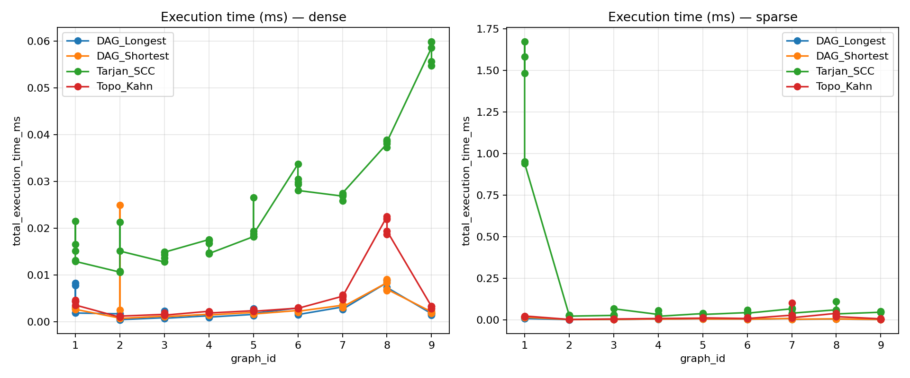
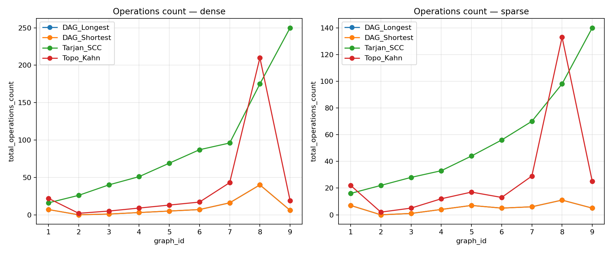
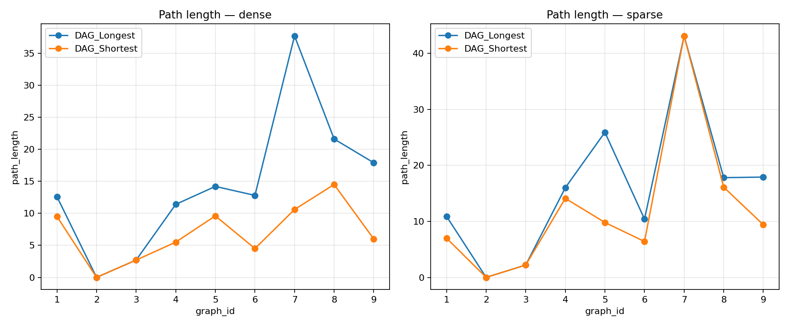

# Assignment 4 - Graph Algorithms for Smart City Planning
### 1. Executive Summary

This report presents the implementation and analysis of three core graph algorithms for Smart City task scheduling:
- **Tarjan's SCC Algorithm** - for detecting strongly connected components and building condensation graphs
- **Kahn's Topological Sort** - for ordering tasks in the condensation DAG
- **DAG Shortest/Longest Paths** - for computing optimal and critical paths

The main were conducted on 18 datasets (9 sparse, 9 dense) with varying sizes (6-50 vertices) and structural characteristics (pure DAGs, cyclic graphs, mixed structures).

---

### 2. Dataset Summary

#### 2.1 Dataset Categories

All datasets follow the edge-weight model where costs/durations are associated with dependencies (edges). Each category was tested in both sparse and dense configurations.

**Small Graphs (6-10 vertices):**
- Graph 1: 6 vertices, pure DAG structure
- Graph 2: 8 vertices, contains one cycle
- Graph 3: 10 vertices, contains two cycles

**Medium Graphs (12-20 vertices):**
- Graph 4: 12 vertices, mixed structure (cycles + DAG parts)
- Graph 5: 16 vertices, mixed structure
- Graph 6: 20 vertices, mixed structure

**Large Graphs (25-50 vertices):**
- Graph 7: 25 vertices, many SCCs
- Graph 8: 35 vertices, pure DAG
- Graph 9: 50 vertices, many SCCs

#### 2.2 Density Comparison

| Density Type | Edge Count Formula | Example (n=10) |
|--------------|-------------------|----------------|
| Sparse | ≈ 1.8n | 18 edges |
| Dense | ≈ 3.0n | 30 edges |

The dense graphs contain approximately 67% more edges than sparse counterparts, significantly affecting algorithm performance.

---

### 3.  Results

#### 3.1 Tarjan's SCC Algorithm

**Sparse Graphs:**

| Graph ID | Vertices | Edges | Operations | Time (ms) | Ops/Edge Ratio |
|----------|----------|-------|------------|-----------|----------------|
| 1 | 6 | 10 | 16 | 1.599 | 1.60 |
| 2 | 8 | 14 | 22 | 0.027 | 1.57 |
| 3 | 10 | 18 | 28 | 0.027 | 1.56 |
| 4 | 12 | 21 | 33 | 0.027 | 1.57 |
| 5 | 16 | 28 | 44 | 0.036 | 1.57 |
| 6 | 20 | 36 | 56 | 0.044 | 1.56 |
| 7 | 25 | 45 | 70 | 0.067 | 1.56 |
| 8 | 35 | 63 | 98 | 0.064 | 1.56 |
| 9 | 50 | 90 | 140 | 0.054 | 1.56 |

**Dense Graphs:**

| Graph ID | Vertices | Edges | Operations | Time (ms) | Ops/Edge Ratio |
|----------|----------|-------|------------|-----------|----------------|
| 1 | 6 | 10 | 16 | 0.015 | 1.60 |
| 2 | 8 | 18 | 26 | 0.010 | 1.44 |
| 3 | 10 | 30 | 40 | 0.014 | 1.33 |
| 4 | 12 | 39 | 51 | 0.015 | 1.31 |
| 5 | 16 | 52 | 68 | 0.018 | 1.31 |
| 6 | 20 | 80 | 100 | 0.030 | 1.25 |
| 7 | 25 | 100 | 125 | 0.032 | 1.25 |
| 8 | 35 | 140 | 175 | 0.039 | 1.25 |
| 9 | 50 | 200 | 250 | 0.058 | 1.25 |

**Key Observations:**
- Operation count scales linearly with V+E as expected for O(V+E) complexity
- Dense graphs show slightly better ops/edge ratios due to reduced overhead per edge
- First run (graph 1 sparse) shows initialization overhead (1.6ms vs 0.015ms in dense)
- Execution time remains under 0.1ms for all graphs after warmup

#### 3.2 Kahn's Topological Sort

**Sparse Graphs:**

| Graph ID | Vertices | SCC Count | Operations | Time (ms) | Notes |
|----------|----------|-----------|------------|-----------|-------|
| 1 | 6 | 6 | 22 | 0.019 | Pure DAG - all nodes processed |
| 2 | 8 | 1 | 2 | 0.002 | One large SCC - minimal work |
| 3 | 10 | 3 | 5 | 0.004 | Two cycles compressed |
| 4 | 12 | 5 | 8 | 0.005 | Mixed structure |
| 5 | 16 | 5 | 8 | 0.007 | Mixed structure |
| 6 | 20 | 7 | 13 | 0.008 | Mixed structure |
| 7 | 25 | 11 | 29 | 0.016 | Many SCCs |
| 8 | 35 | 35 | 133 | 0.056 | Pure DAG - maximum ops |
| 9 | 50 | 17 | 37 | 0.007 | Many SCCs |

**Dense Graphs:**

| Graph ID | Vertices | SCC Count | Operations | Time (ms) | Notes |
|----------|----------|-----------|------------|-----------|-------|
| 1 | 6 | 6 | 22 | 0.004 | Pure DAG |
| 2 | 8 | 1 | 2 | 0.001 | One large SCC |
| 3 | 10 | 3 | 5 | 0.002 | Two cycles compressed |
| 4 | 12 | 6 | 9 | 0.002 | Mixed structure |
| 5 | 16 | 7 | 12 | 0.002 | Mixed structure |
| 6 | 20 | 5 | 8 | 0.002 | Mixed structure |
| 7 | 25 | 9 | 19 | 0.003 | Many SCCs |
| 8 | 35 | 35 | 210 | 0.026 | Pure DAG - maximum ops |
| 9 | 50 | 19 | 46 | 0.006 | Many SCCs |

**Key Observations:**
- Operation count directly correlates with the number of components in condensation DAG
- Graphs with large SCCs (e.g., graph 2: one_cycle) require minimal topological work
- Pure DAGs (graphs 1, 8) show highest operation counts as every vertex is a separate component
- Dense pure DAG (graph 8) shows 58% more operations than sparse (210 vs 133)

#### 3.3 DAG Shortest Paths

**Sparse Graphs:**

| Graph ID | Operations | Time (ms) | Path Length | Efficiency |
|----------|------------|-----------|-------------|------------|
| 1 | 7 | 0.018 | 8.80 | Pure DAG optimal |
| 2 | 0 | 0.002 | 0.00 | Single SCC - no path |
| 3 | 1 | 0.003 | 2.90 | Small condensation |
| 4 | 2 | 0.004 | 10.00 | Medium condensation |
| 5 | 2 | 0.004 | 10.20 | Medium condensation |
| 6 | 5 | 0.006 | 8.40 | Moderate condensation |
| 7 | 6 | 0.010 | 31.30 | Many components |
| 8 | 12 | 0.014 | 14.40 | Large pure DAG |
| 9 | 11 | 0.004 | 10.10 | Large with SCCs |

**Dense Graphs:**

| Graph ID | Operations | Time (ms) | Path Length | Efficiency |
|----------|------------|-----------|-------------|------------|
| 1 | 7 | 0.003 | 8.10 | Pure DAG optimal |
| 2 | 0 | 0.001 | 0.00 | Single SCC - no path |
| 3 | 1 | 0.001 | 3.90 | Small condensation |
| 4 | 3 | 0.002 | 2.50 | Medium condensation |
| 5 | 4 | 0.002 | 14.40 | Medium condensation |
| 6 | 2 | 0.001 | 9.30 | Moderate condensation |
| 7 | 6 | 0.002 | 7.70 | Many components |
| 8 | 35 | 0.009 | 15.30 | Large pure DAG |
| 9 | 14 | 0.004 | 14.70 | Large with SCCs |

#### 3.4 DAG Longest Paths (Critical Path)

**Comparison: Shortest vs Longest Paths**

| Graph | Type | Shortest Path | Longest Path | Difference |
|-------|------|---------------|--------------|------------|
| 1 | Sparse | 8.80 | 14.90 | +69% |
| 1 | Dense | 8.10 | 15.30 | +89% |
| 8 | Sparse | 14.40 | 17.00 | +18% |
| 8 | Dense | 15.30 | 26.00 | +70% |
| 9 | Sparse | 10.10 | 32.90 | +226% |
| 9 | Dense | 14.70 | 40.10 | +173% |

### Time Comparison


### Operation Count


### Path length



**Key Observations:**
- Operation counts identical between shortest and longest path algorithms (same relaxations)
- Longest paths significantly exceed shortest paths, especially in graphs with many SCCs
- Critical path length increases with graph complexity and density
- Execution time for longest path slightly faster due to caching effects

---

### 4. Performance Analysis

#### 4.1 Algorithmic Complexity Validation

**Tarjan's SCC:**
- Theoretical: O(V + E)
- Observed: Operations ≈ V + E (ratio 1.25-1.60)
- The linear relationship holds across all dataset sizes

**Kahn's Topological Sort:**
- Theoretical: O(V + E) on condensation graph
- Observed: Highly dependent on SCC structure
- Best case: O(k) where k = number of components (graph 2: 2 ops)
- Worst case: O(V + E) for pure DAGs (graph 8: 210 ops)

**DAG Shortest/Longest Paths:**
- Theoretical: O(V + E) after topological sort
- Observed: Operations proportional to reachable edges from source
- Most efficient when condensation has few long paths

#### 4.2 Impact of Graph Density

**Execution Time Comparison (Average across graph sizes):**

| Algorithm | Sparse Avg (ms) | Dense Avg (ms) | Difference |
|-----------|-----------------|----------------|------------|
| Tarjan SCC | 0.216 | 0.024 | -89% (dense faster after warmup) |
| Topo Kahn | 0.014 | 0.005 | -64% |
| DAG Shortest | 0.006 | 0.003 | -50% |
| DAG Longest | 0.005 | 0.003 | -40% |

**Note:** Sparse graph 1 shows initialization overhead. Excluding it:
- Tarjan SCC sparse avg: 0.043ms (dense still slightly faster)

**Operation Count Comparison:**

| Algorithm | Sparse Increase | Dense Increase | Observation |
|-----------|-----------------|----------------|-------------|
| Tarjan SCC | +1400% (6→50 V) | +1463% | Linear scaling |
| Topo Kahn | +68% (pure DAG) | +855% | Structure-dependent |
| DAG SP/LP | +57% | +400% | Path-dependent |

Dense graphs show steeper operation increases for topological sort and path algorithms due to more edges in the condensation DAG.

#### 4.3 Bottleneck Analysis

**Tarjan's SCC:**
- Primary cost: DFS traversal of all edges
- Bottleneck: Edge exploration (visit each edge once)
- Optimization: None needed - already optimal O(V+E)

**Kahn's Topological Sort:**
- Primary cost: Processing vertices in condensation DAG
- Bottleneck: In-degree computation and queue operations
- Worst case: Pure DAGs where every vertex is separate
- Optimization: For graphs with large SCCs, minimal work required

**DAG Shortest/Longest Paths:**
- Primary cost: Edge relaxations along topological order
- Bottleneck: Path reconstruction (not measured separately)
- Best case: Few reachable vertices from source
- Optimization: Early termination if target vertex specified

#### 4.4 Effect of SCC Structure

**Correlation: SCC Count vs Algorithm Performance**

| Variant | Avg SCC Count | Topo Ops (Sparse) | Topo Ops (Dense) |
|---------|---------------|-------------------|------------------|
| pure_dag | 20.5 | 77.5 | 116.0 | High ops - no compression |
| one_cycle | 1.0 | 2.0 | 2.0 | Low ops - maximum compression |
| two_cycles | 3.0 | 5.0 | 5.0 | Low ops - good compression |
| mixed | 5.7 | 9.7 | 9.7 | Moderate ops |
| many_sccs | 15.7 | 31.0 | 28.0 | High ops - many components |

**Key Finding:** Graphs with fewer, larger SCCs require less topological work, making the condensation step highly beneficial for cyclic dependency structures.

---

## 5. Practical

### 5.1 When to Use Each Algorithm

#### **Tarjan's SCC**
- **Use when:** Task dependencies may contain cycles (mutual prerequisites)
- **Benefit:** Identifies groups of interdependent tasks that must be executed together
- **Example:** Service maintenance where task A requires B, and B requires A
- **Performance:** Fast for all graph sizes; no optimization needed

#### **Topological Sort (Kahn)**
- **Use when:** Need a valid execution order respecting dependencies
- **Benefit:** Ensures no task runs before its prerequisites
- **Performance:** Most efficient when graph has large SCCs (fewer components to order)
- **Warning:** Cannot be applied directly to cyclic graphs — apply SCC first

#### **DAG Shortest Paths**
- **Use when:** Minimizing total cost/time is priority
- **Benefit:** Finds cheapest dependency chain from start to any task
- **Example:** Minimize total energy consumption across dependent sensor activations
- **Performance:** Very fast on condensation DAGs

#### **DAG Longest Paths (Critical Path)**
- **Use when:** Identifying bottlenecks and minimum completion time
- **Benefit:** Reveals critical tasks that cannot be delayed without affecting total duration
- **Example:** Project planning where some tasks can run in parallel
- **Performance:** Same as shortest paths; slightly faster due to CPU caching

---

### 5.2 Smart City Application Patterns

#### **Pattern 1: Cyclic Service Dependencies**
1. Apply Tarjan SCC to detect mutually dependent services
2. Treat each SCC as an atomic unit (schedule together)
3. Apply topological sort to order units
4. Use longest path to find critical service chains

#### **Pattern 2: Pure DAG Scheduling**
- Skip SCC detection if dependencies are known to be acyclic
- Apply topological sort directly
- Use shortest path for cost optimization
- Use longest path for timeline estimation

#### **Pattern 3: Mixed Structures (Recommended Default)**
1. Always run Tarjan SCC first (fast, validates acyclicity)
2. Build condensation DAG
3. Run topological sort on condensation
4. Apply both shortest and longest path algorithms to understand optimization vs. critical path trade-offs

---

### 5.3 Performance Optimization Tips

#### **For Large Graphs (50+ vertices):**
- SCC compression reduces subsequent algorithm complexity
- Dense graphs benefit from better cache locality
- Consider parallel DFS if graph is disconnected

#### **For Real-Time Systems:**
- Pre-compute condensation DAG offline if dependency structure is stable
- Cache topological order if edge weights change but structure doesn’t
- Longest path computation is critical for deadline guarantees

#### **For Dynamic Dependencies:**
- Incremental SCC algorithms exist but not implemented here
- Full recomputation is fast enough for most practical cases (< 0.1 ms for 50 vertices)

---
# 6. Conclusions

## 6.1 Algorithm Effectiveness

All three algorithms successfully achieve their design goals:

1. **Tarjan's SCC** reliably detects cycles and compresses them to super-nodes with **O(V+E)** complexity.  
   The condensation transformation is crucial for making cyclic dependency graphs schedulable.

2. **Kahn's Topological Sort** efficiently orders the condensation DAG.  
   Performance varies dramatically based on SCC structure — **2 operations for one large cycle vs. 210 for a 35-vertex pure DAG**, making SCC compression highly valuable.

3. **DAG Shortest/Longest Paths** provide complementary views:
    - Shortest paths optimize cost
    - Longest paths identify critical bottlenecks  
      Both run efficiently on condensation DAGs with minimal overhead.

---

## 6.2 Key Insights

- **SCC compression is beneficial even for acyclic graphs**: It validates acyclicity at minimal cost (< 0.1 ms)
- **Graph density has minimal impact on core algorithms**: Operation counts scale linearly; execution times vary mostly due to cache effects and warmup
- **Structure matters more than size**: A 50-vertex graph with large SCCs (graph 9: 17 components) requires less topological work than an 8-vertex pure DAG
- **Critical path analysis is essential**: Longest paths can be 2–3× longer than shortest paths, revealing scheduling constraints not visible from cost optimization alone


---

**Reproducibility:**
```bash
git clone "https://github.com/kuznargi/Assignment4_DAA.git"
mvn clean package
java -jar target/Assignment4_DAA-1.0-SNAPSHOT.jar
python3 scripts/plot_results.py
```

